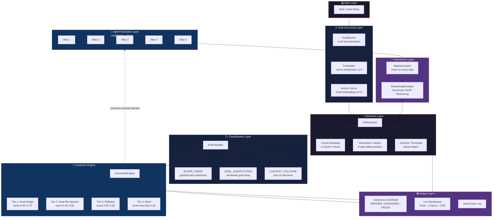
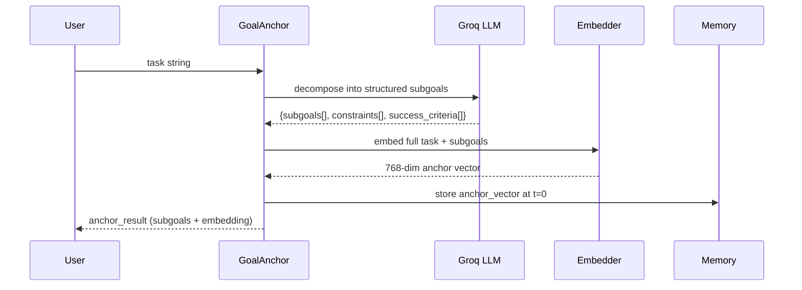
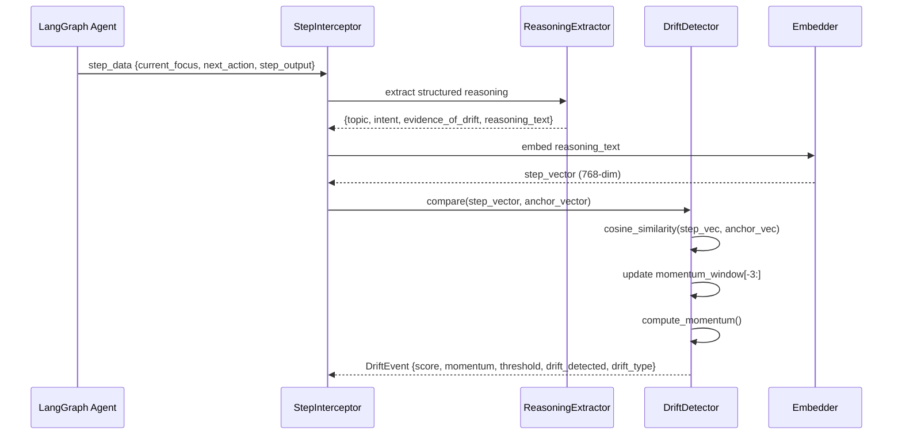
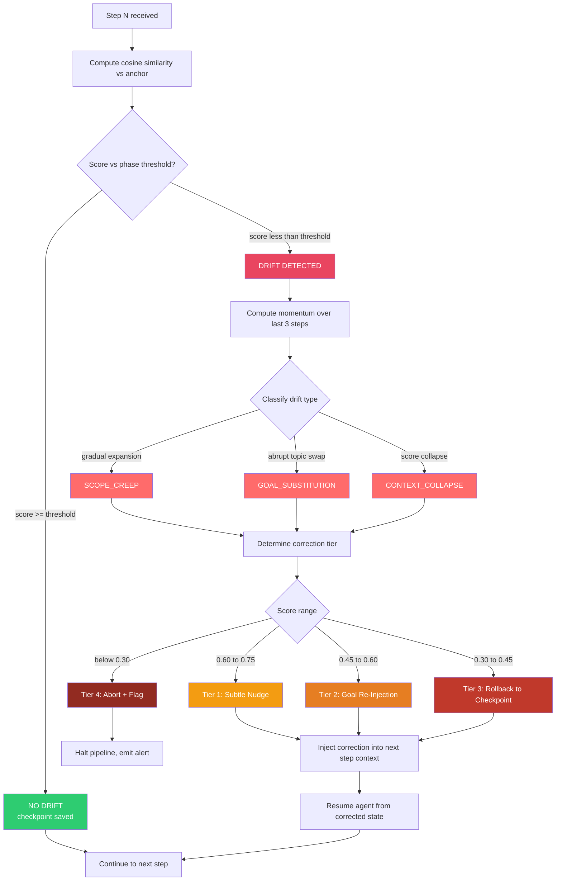
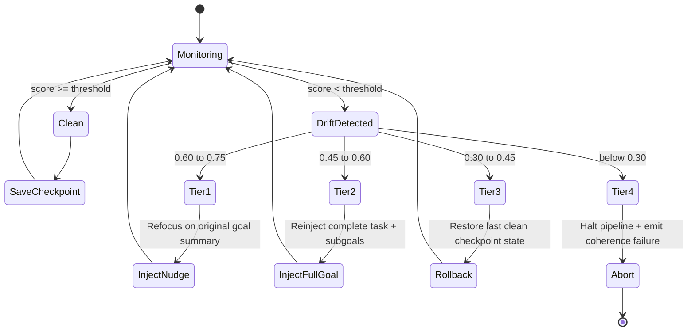
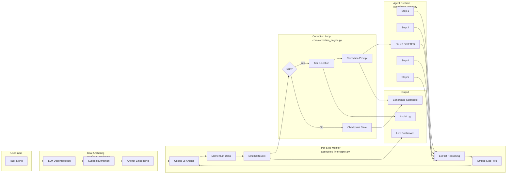
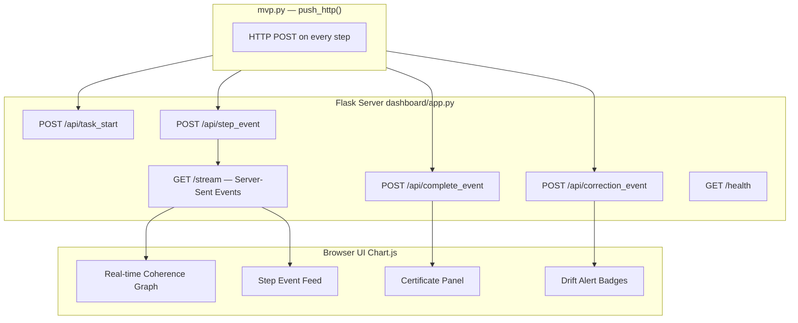

<div align="center">
        
# DriftWatch

### Real-Time Goal Coherence Monitoring for Autonomous AI Agents

[](https://python.org)
[](https://github.com/langchain-ai/langgraph)
[](https://console.groq.com)
[](https://flask.palletsprojects.com)
[](LICENSE)
[](https://unstop.com)
[]()

**Autonomous agents fail silently. DriftWatch doesn't let them.**

By step 7 of 12, most agents have quietly replaced the original goal with a sub-goal — and nobody knows. DriftWatch detects this in real time, classifies the failure type, and autonomously corrects — without human interruption, in under 60ms per step.

[🚀 Quick Start](#-quick-start) · [🏗 Architecture](#-system-architecture) · [⚙️ How It Works](#️-how-it-works-step-by-step) · [📁 File Structure](#-repository-structure) · [📊 Dashboard](#-live-dashboard) · [🧪 Demo Scenarios](#-demo-scenarios)

</div>

---

## 🔴 The Problem: Silent Goal Substitution

Modern autonomous agents — research pipelines, coding bots, legal reviewers — fail in a way that looks like success. They complete *a* task, just not *your* task. No error. No warning. No trace.

```
Task: "Research lithium mining water impacts → write 3 enforceable regulations"

Step 1: ✅ Reviewing hydrogeology papers              [coherence: 0.91]
Step 2: ✅ Analyzing contamination data               [coherence: 0.88]
Step 3: ⚠️  Expanding to EV battery technology        [coherence: 0.71]  ← drift starts
Step 4: 🔴 Writing about EV market subsidy trends     [coherence: 0.52]  ← GOAL SUBSTITUTION
Step 5: 🔴 Recommending EV adoption policy            [coherence: 0.41]  ← wrong output entirely

Result: A policy brief about EVs instead of water contamination regulations.
        No crash. No error. Looks complete. Is completely wrong.
```

This is not an edge case. This is the default behavior of multi-step agentic systems operating without a coherence monitor.

---

## ✅ The Solution: DriftWatch Intervenes

DriftWatch intercepts every agent step, computes semantic coherence against the anchored goal, tracks drift momentum across a sliding window, and fires a tiered correction — recovering the agent back on track.

```
Step 3: score=0.71 | momentum=-0.09 | SCOPE_CREEP → Tier 1 correction: goal re-injection
Step 4: score=0.86 | momentum=+0.15 | RECOVERED ✅
Step 5: score=0.88 | CONCLUDE phase | on track ✅

Final output: Correct 3-regulation water policy brief ✅
```

---

## 🏗 System Architecture



---

## ⚙️ How It Works: Step-by-Step

### Phase 1 — Goal Anchoring (`core/goal_anchor.py`)



Before execution begins, the task is passed through `GoalAnchor`, which calls the Groq LLM to decompose the task into structured subgoals, constraints, and success criteria. This structured representation is then embedded using `nomic-embed-text-v1.5` into a 768-dimensional anchor vector — the ground truth reference for the entire run.

---

### Phase 2 — Per-Step Interception & Scoring (`agent/step_interceptor.py`)



Every agent step is intercepted via `StepInterceptor`. The step's reasoning is extracted as structured JSON by `ReasoningExtractor`, embedded, and compared to the anchor vector via cosine similarity. The `DriftDetector` maintains a 3-step sliding window to compute drift **momentum** — not just a single-step score, but the directional trend.

---

### Phase 3 — Drift Detection & Classification



The detection logic is **phase-aware** — thresholds shift based on which execution phase the agent is in:

| Phase | Steps | Threshold | Rationale |
|-------|-------|-----------|-----------|
| `INITIALIZE` | 1 | 0.40 | Context gathering, allow loose |
| `RESEARCH` | 2 | 0.55 | Should start narrowing |
| `ANALYZE` | 3 | 0.65 | Core work, enforce coherence |
| `SYNTHESIZE` | 4 | 0.70 | Must be tightly goal-aligned |
| `CONCLUDE` | 5 | 0.72 | Output must match goal directly |

---

### Phase 4 — Correction Response (`core/correction_engine.py`)



---

### Phase 5 — Coherence Certificate Generation

After all steps complete, `CorrectionEngine.generate_certificate()` computes:

- **Average coherence score** across all steps
- **Drift count** and correction count
- **Verdict**: `VERIFIED` / `DEGRADED` / `FAILED`
- **Trend analysis**: improving, stable, or declining
- Full audit trail for every step and correction applied

---

## 📁 Repository Structure

```
driftwatch/
│
├── 📄 mvp.py                        ← Primary MVP entry point (473 lines)
│                                       --verify | --demo1..5 | --all5 | --dashboard
│
├── core/                            ← Detection & correction brain
│   ├── embedder.py                  ← Sentence embedding via nomic-embed-text-v1.5 (<60ms)
│   ├── drift_detector.py            ← Cosine similarity + 3-step momentum tracking
│   ├── drift_classifier.py          ← SCOPE_CREEP / GOAL_SUBSTITUTION / CONTEXT_COLLAPSE
│   ├── goal_anchor.py               ← LLM-powered task decomposition → anchor vector
│   └── correction_engine.py         ← 4-tier correction + checkpoint + certificate
│
├── agent/                           ← LangGraph agent runtime
│   ├── base_agent.py                ← LangGraph 5-step agent (Groq Llama 3.1 70B)
│   ├── step_interceptor.py          ← Per-step hook, event queue, anchor management
│   └── reasoning_extractor.py       ← Structured JSON reasoning extraction from LLM
│
├── dashboard/                       ← Live monitoring UI
│   └── app.py                       ← Flask server: SSE stream + REST endpoints
│                                       /api/task_start | /api/step_event
│                                       /api/correction_event | /api/complete_event
│
├── demos/                           ← Pre-configured polished demo scenarios
│
├── benchmark/                       ← A/B comparison suite: with vs without DriftWatch
│
├── run_day1.py                      ← Day 1 tests (no API key needed, fully offline)
├── run_day2.py                      ← Day 2 full pipeline test
├── run_day3.py                      ← Day 3 extended scenarios
├── run_day4.py                      ← Day 4 benchmark + dashboard integration
├── test_setup.py                    ← Environment health check
├── requirements.txt                 ← Python dependencies
└── .env.example                     ← Environment variable template
```

---

## 🔄 End-to-End Data Flow



---

## 🧪 Demo Scenarios

DriftWatch ships with **5 pre-wired demo scenarios**, each with a controlled drift injection at step 3:

| Demo | Domain | Task | Drift Injected at Step 3 |
|------|--------|------|--------------------------|
| `--demo1` | Research | Write 3 water contamination regulations from lithium mining data | EV market adoption trends |
| `--demo2` | Coding | Build JWT auth module (login, generate, validate, refresh) | OAuth2 social login expansion |
| `--demo3` | Legal | List 3 NDA liability risks for a startup | Delaware incorporation + cap tables |
| `--demo4` | Analytics | 3 inventory recommendations for a bookstore chain | PyTorch LSTM model training |
| `--demo5` | Writing | 200-word product announcement for a water filter | 12-month brand rebranding strategy |

Each demo runs a real Groq LLM agent, injects synthetic drift at step 3, and demonstrates live recovery with coherence scores printed per step.

---

## 📊 Live Dashboard



The dashboard runs as a **separate Flask process** on `localhost:5000`. `mvp.py` pushes events via `push_http()` after each step — the dashboard receives them via Server-Sent Events (SSE) and updates the Chart.js coherence timeline in real time.

---

## 🚀 Quick Start

### Prerequisites

- Python 3.9+
- Free [Groq API key](https://console.groq.com) (no credit card needed)

### Installation

```bash
# 1. Clone the repository
git clone https://github.com/TecqHarishKrish/Driftwatch-Agentic_Autonomous_Systems
cd Driftwatch-Agentic_Autonomous_Systems

# 2. Install dependencies
pip install -r requirements.txt

# 3. Configure environment
cp .env.example .env
# Edit .env → paste your free Groq API key

# 4. Verify everything is working
python mvp.py --verify
```

### Running Demos

```bash
# Terminal 1 — Start live dashboard (optional but strongly recommended)
python -m dashboard.app

# Terminal 2 — Run demos
python mvp.py --demo1       # Research: lithium policy brief
python mvp.py --demo2       # Coding: JWT auth module
python mvp.py --demo3       # Legal: NDA liability risks
python mvp.py --demo4       # Analytics: inventory recommendations
python mvp.py --demo5       # Writing: product announcement
python mvp.py --all5        # Run all 5 demos sequentially
python mvp.py --both        # Run demo1 + demo2 only

# Offline tests (no API key needed)
python run_day1.py
```

### Expected CLI Output

```
══════════════════════════════════════════════════════════════
  DriftWatch — DEMO 1 — RESEARCH
══════════════════════════════════════════════════════════════
  Task: Research the environmental impact of lithium mining...
  Drift injection: step(s) [3]
══════════════════════════════════════════════════════════════

[1/4] Anchoring goal...
[2/4] Running 5-step agent via Groq...
[3/4] DriftWatch monitoring each step...

  >>> DRIFT INJECTION at step 3 <<<

  Step  Score    Thr    Status                 Correction
  ────────────────────────────────────────────────────────
  1     0.912    0.40   OK                     —
  2     0.881    0.55   OK                     —
  3     0.519    0.65   DRIFT:GOAL_SUBSTITUTION TIER_2_REINJECT
  4     0.863    0.70   OK                     —
  5     0.891    0.72   OK                     —

[4/4] Generating coherence certificate...

  ✅ COHERENCE CERTIFICATE — VERIFIED
     Average score: 0.813 | Drifts: 1 | Corrections: 1
```

---

## 🛠 Tech Stack

| Component | Tool | Why |
|-----------|------|-----|
| LLM Inference | Groq (Llama 3.1 70B / 8B instant) | Fastest free-tier inference, ~200ms |
| Embeddings | Groq `nomic-embed-text-v1.5` (768-dim) | Free, high-quality semantic vectors |
| Agent Framework | LangGraph | Structured multi-step agent state machine |
| Drift Detection | `numpy` cosine similarity + sliding window | <5ms per step, no GPU needed |
| Dashboard | Flask + Chart.js + SSE | Lightweight, zero-dependency frontend |
| **Total infrastructure cost** | | **₹0 / $0** |

---

## 🔑 Environment Variables

```bash
# .env
GROQ_API_KEY=your_groq_api_key_here          # Required — get free at console.groq.com
DASHBOARD_PORT=5000                           # Optional — default 5000
DRIFT_THRESHOLD=0.65                          # Optional — base coherence threshold
MOMENTUM_WINDOW=3                             # Optional — steps in momentum window
```

---

## 📐 Core Concepts Explained

### Cosine Similarity as Goal Coherence
Every step's reasoning is embedded into a 768-dimensional vector using the same model that embedded the anchor goal. The cosine similarity between the step vector and the anchor vector gives a score from 0 (completely unrelated) to 1 (semantically identical). A score below the phase-aware threshold triggers drift detection.

### Momentum — The Key Innovation
A single low score could be noise. DriftWatch tracks the **momentum** of the last 3 scores:

```
momentum = mean(scores[-3:]) - scores[-3]
```

Negative momentum (declining trend) → escalate correction tier.  
Positive momentum (recovering) → de-escalate or hold.

### Drift Classification
- **SCOPE_CREEP**: Score gradually declining across ≥2 steps. Agent is expanding scope beyond the goal boundary.
- **GOAL_SUBSTITUTION**: Abrupt single-step score drop >0.2. Agent has swapped its working goal wholesale.
- **CONTEXT_COLLAPSE**: Score < 0.35. Agent has lost the goal entirely; no clear connection to original task.

### Coherence Certificate
A structured artifact emitted after task completion. Acts as a tamper-evident audit record that the output was produced under monitored conditions. Contains: verdict, average score, drift events, correction log, and timestamp.

---

## 🗺 Roadmap

- [x] Core drift detection engine (cosine + momentum)
- [x] 4-tier correction system with rollback
- [x] LangGraph 5-step agent integration
- [x] Structured goal anchoring via LLM
- [x] Live Flask dashboard with SSE
- [x] Coherence certificate generation
- [x] 5 demo scenarios with synthetic drift injection
- [x] Offline mode (run_day1.py — no API key needed)
- [ ] Multi-agent graph support (agent-to-agent drift monitoring)
- [ ] Vector database integration for historical drift pattern analysis
- [ ] REST API wrapper for external agent frameworks
- [ ] Webhook-based correction for production deployments
- [ ] Plugin for AutoGen / CrewAI / OpenAI Swarm

---

## 👥 Team

**Team Fusion Force** — Built for [FAR AWAY International Hackathon 2026]([https://unstop.com](https://unstop.com/hackathons/far-away-zuup-1677472))

| Member | Role |
|--------|------|
| Harishwar R | Architecture, core engine, agent integration |
| Sandhiya V S | Dashboard, demo scenarios |
| Sukant B | Benchmarking, testing |

KIT – Kalaignarkarunanidhi Institute of Technology, Coimbatore

---

## 📄 License

MIT License — see [LICENSE](LICENSE) for details.

---

<div align="center">

**DriftWatch** — Because an agent that finishes the wrong task isn't intelligence. It's liability.

⭐ Star this repo if DriftWatch saved your agent from itself.

</div>
